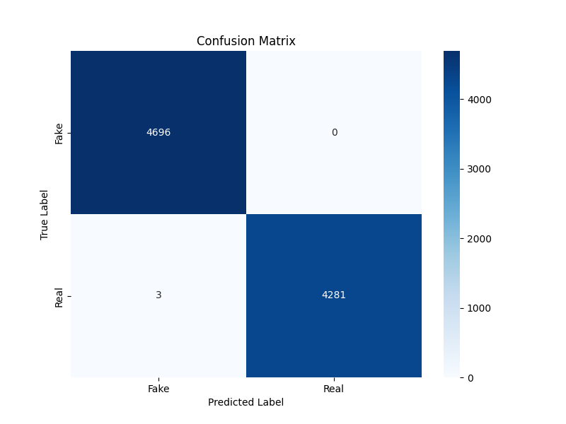

# Fake News Detector Flask Application


## 📌 Overview

A lightweight Flask web application that uses BERT-based AI to detect fake news articles. I used pre-trained BERT to perform the classification task on publicly available dataset of fake news. BERT is a Natural Language Processing (NLP) model that has been made open-source.

<p align="center">
  
</p>
<br/>
<p align="center">
  &nbsp;
  
</p>

## ✨ Key Features

-   User-friendly interface for submitting news articles
-   AI-powered analysis using BERT model
-   Visual representation of results with confidence scores
-   Clean, responsive design that works on all devices

## 🛠️ Technical Stack

-   Flask
-   PyTorch
-   Transformers (Hugging Face)
-   BERT pre-trained model

## 📊 Dataset Source

The model was trained on [Fake News Dataset](https://www.kaggle.com/datasets/emineyetm/fake-news-detection-datasets)

## 📈 Model Results

<p align="center">
 
</p>
<br/>
<p align="center">
  
  
</p>

## 🚀 Getting Started

### Prerequisites

-   Python 3.8+
-   pip package manager
-   Git (optional)

### Installation

1. Clone the repository:

```bash
git clone https://github.com/YAHYA-YOUNAS/AI-Fake-News-Detector.git
cd AI-Fake-News-Detector
```

2. Create a virtual environment:

```bash
python -m venv venv
source venv/bin/activate  # On Windows use `venv\Scripts\activate`
```

3. Install dependencies:

```bash
pip install -r requirements.txt
```

4. Make sure you have a trained model file:
    - Either train your own model using the original fake news detector code and move the resulting `best_fake_news_model.pt` file to the `models/` directory
    - Or contact me for `best_fake_news_model.pt` file

## Usage

1. Start the Flask application:

    ```
    python app.py
    ```

2. Open your web browser and navigate to:

    ```
    http://127.0.0.1:5000/
    ```

3. Enter a news article title and content in the form, then click "Analyze News"

4. Review the results showing whether the article is likely real or fake

## Project Structure

-   `app.py`: Main Flask application file
-   `models/detector.py`: Implementation of the fake news detector interface
-   `static/css/styles.css`: CSS styles for the web application
-   `static/js/script.js`: JavaScript for frontend interaction
-   `templates/index.html`: HTML template for the main page

## 🤝 Contributing

Contributions are welcome! Please follow these steps:

1. Fork the repository
2. Create your feature branch (`git checkout -b feature/AmazingFeature`)
3. Commit your changes (`git commit -m 'Add some AmazingFeature'`)
4. Push to the branch (`git push origin feature/AmazingFeature`)
5. Open a Pull Request

## 📜 License

This project is licensed under the MIT License.
